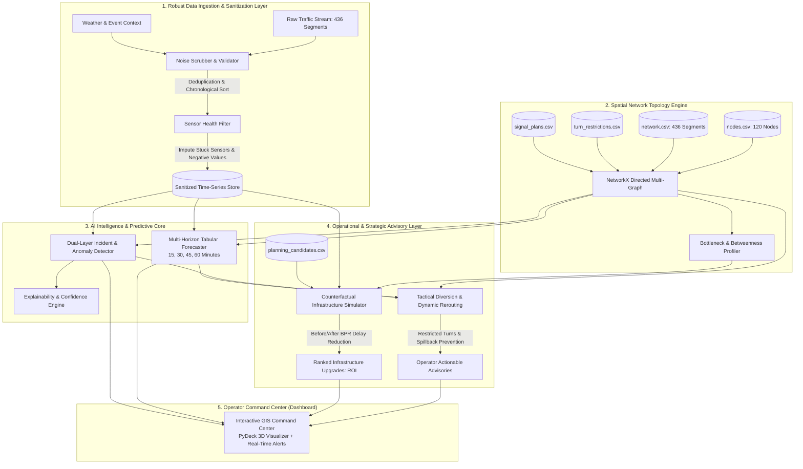

<div align="center">

# 🚦 CityFlow AI: Urban Traffic Flow & Incident Intelligence System
### *Next-Generation Decision-Support System for Dense Urban Road Networks*

[](https://www.python.org/)
[](LICENSE)
[](https://lightgbm.readthedocs.io/)
[](https://streamlit.io/)
[](#)

</div>

---

## 📌 Executive Summary & Problem Understanding

Modern metropolitan cities like **Hyderabad** face intense, dynamic urban mobility challenges. High-density mixed traffic, sharp peak-hour commuter surges between tech corridors (e.g., Hitec City, Gachibowli, Financial District) and residential hubs, frequent signalized intersections, complex flyover ramps, sudden monsoon flash rain slowdowns, and localized breakdown incidents lead to rapid congestion cascades and upstream spillback.

Traditional traffic management systems suffer from two catastrophic flaws:
1. **Reactive Operation**: Interventions occur only after corridors gridlock, causing severe commuter delay and economic loss.
2. **Disconnected Planning**: Daily operational diversion advisories are completely divorced from long-term capital infrastructure planning (flyovers, lane additions, junction geometry redesign).

### 🎯 Core Mission: Decision Support, Not a Navigation App
**CityFlow AI** is **not** another consumer turn-by-turn navigation app, nor is it a generic LLM chatbot wrapper. 

CityFlow AI is an **enterprise-grade, software-only decision-support platform for municipal traffic control centers (TCCs) and urban planning authorities**. It continuously analyzes road-network topologies and sensor streams to:
- **Infer** real-time network states and filter severe telemetry noise (stuck sensors, impossible negative readings, row shuffle, sensor drift).
- **Anticipate** congestion and flow conditions **15, 30, 45, and 60 minutes into the future** with quantified uncertainty.
- **Detect & Classify** localized incidents and abnormal traffic behavior while actively suppressing false alarms through neighborhood consensus.
- **Recommend** tactical, turn-restricted diversion corridors to relieve bottlenecks before spillback blocks downstream junctions.
- **Simulate & Prioritize** long-term infrastructure interventions (`planning_candidates.csv`) using counterfactual before/after impact modeling to compute verifiable Return on Investment ($\Delta\text{Delay Hours} / \text{Cost Index}$).

---

## 🏛️ System Architecture

CityFlow AI operates as a decoupled, multi-stage intelligence pipeline designed for sub-second decision-support inference.



---

## 📐 Mathematical Formulation & Technical Approach

### 1. Congestion Index ($CI$) & Link Delay Modeling
Each road segment $e = (u, v)$ has a free-flow speed $v_f$ and observed speed $v(t)$. The instantaneous Congestion Index $CI_e(t) \in [0, 1]$ is formulated as:

$$CI_e(t) = \max\left(0, \min\left(1, 1 - \frac{v_e(t)}{v_{f,e}}\right)\right)$$

Travel time delay $D_e(t)$ over link length $L_e$ is derived using an adapted **Bureau of Public Roads (BPR)** formulation taking capacity $C_e$ and peak capacity degradation factors $\alpha_e$ into account:

$$t_e(t) = t_{0,e} \left(1 + \alpha \left(\frac{q_e(t)}{\phi_e \cdot C_e}\right)^\beta\right)$$

where $t_{0,e} = \frac{L_e}{v_{f,e}}$, $q_e(t)$ is vehicular flow (vph), and $\phi_e$ is the active capacity degradation factor (accounting for roadworks or lane closures).

### 2. Multi-Horizon Traffic State Forecasting
To forecast traffic across four discrete horizons $\tau \in \{15, 30, 45, 60\}$ minutes:
$$\hat{Y}_{e, t+\tau} = f_\theta\left(X_{e, t}, X_{e, t-1}, X_{e, t-2}, \mathcal{N}(e), C(t), W(t)\right)$$
- **Features ($X$)**: Lagged speed/flow ($t-5m, t-10m, t-15m$), rolling mean, rolling volatility, sensor quality index.
- **Topology ($\mathcal{N}(e)$)**: Upstream and downstream segment flow pressures, signal cycle green ratio.
- **Context ($C(t), W(t)$)**: Rain intensity, temperature, holiday flags, diurnal cycle ($(\sin, \cos)$ hour encoding).
- **Engine**: Multi-target LightGBM models trained with Huber loss to resist outlier spikes without target leakage.

### 3. Dual-Layer Incident Detection with Consensus
To eradicate false positives from transient sensor noise:
1. **Statistical Anomaly**: Detect sharp velocity drop and occupancy divergence:
   $$Z_e(t) = \frac{v_e(t) - \mu_e(h, d)}{\sigma_e(h, d)} < -2.5 \quad \land \quad \text{Occupancy}_e(t) > 1.5 \cdot \bar{O}_e$$
2. **Spatial-Temporal Consensus**: An anomaly is only confirmed as an incident if:
   - It persists for $\ge 2$ consecutive timestamps ($10$ minutes), OR
   - Upstream segment exhibits queue spillback ($\Delta \text{queue} > 0$).

### 4. Turn-Restricted Diversion Optimization
Given an incident on segment $e^* = (u, v)$, the rerouting engine solves a constrained shortest-path problem on directed graph $G = (V, E)$ with turn penalty matrix $P(e_i, e_j) \in \{0, \infty\}$:

$$\min_{\mathcal{P}_{o \to d}} \sum_{e \in \mathcal{P}} \left( t_e(q_e) + P(e_{k-1}, e_k) \right) \quad \text{s.t.} \quad e^* \notin \mathcal{P}, \quad P(e_{k-1}, e_k) < \infty$$

### 5. Counterfactual Infrastructure ROI
For planning candidate $k \in \mathcal{K}$ on target segment $e$, we simulate the counterfactual network equilibrium with capacity $C_e' = C_e + \Delta C_k$:

$$\text{ROI}_k = \frac{\sum_{t \in \mathcal{T}} \sum_{e \in \mathcal{E}} \left( \text{Delay}_e^{\text{baseline}}(t) - \text{Delay}_e^{\text{counterfactual}}(t) \right)}{\text{Cost Index}_k}$$

---

## 🛡️ Robustness: Noise Scrubber & Telemetry Defense

The NeuraX Smart Cities benchmark injects severe synthetic and real-world sensor corruptions. CityFlow AI features an automated pre-flight sanitization pipeline:

| Telemetry Defect | Manifested Failure | CityFlow AI Defense Mechanism |
| :--- | :--- | :--- |
| **Row Shuffle** | Timestamps out of temporal order | Fast multi-index chronological sorting on `(segment_id, timestamp)`. |
| **Stuck Sensors** | Sensor outputs static value for hours | Zero-variance sliding window ($N=6$ steps); flags `sensor_quality = 0.0` and interpolates from upstream topology. |
| **Spurious Negatives** | Impossible values ($v < 0$, $q < 0$) | Physical feasibility clamping ($v \in [0, 1.2 \cdot v_f]$); median rolling window imputation. |
| **Sensor Spikes** | Physics-defying accelerations | Acceleration delta check: $|\Delta v / \Delta t| > a_{\max}$ clipped to moving average. |
| **Missing Readings** | Gaps in temporal observations | Spatial-temporal kriging using upstream/downstream network propagation. |

---

## 🗂️ Project Directory Structure

```
cityflow-hackathon/
├── .planning/                         # Project Management & GSD Durable State
│   ├── ROADMAP.md                     # Checkpoint milestones & rubric tracking
│   ├── STATE.md                       # Current active focus & key decisions
│   ├── PLAN.md                        # Sprint execution plan
│   └── UAT.md                         # Checkpoint verification & test criteria
├── .gitignore                         # Data file protection & repo hygiene
├── README.md                          # Checkpoint 1 Comprehensive System Spec
├── requirements.txt                   # Environment dependencies
├── tests/                             # Verification & Regression Test Suite
│   ├── test_cleaner.py                # Tests for noise scrubber & stuck sensors
│   ├── test_graph.py                  # Tests for topology & turn restrictions
│   ├── test_incident_detector.py      # Tests for anomaly classification
│   └── test_forecaster.py             # Tests for 15-60m inference latency & shapes
├── cityflow/                          # Modular Analytics Engine
│   ├── __init__.py
│   ├── cleaner.py                     # Telemetry sanitization & imputation
│   ├── graph.py                       # NetworkX topology, turn limits & signals
│   ├── incident_detector.py           # Dual-layer incident & anomaly engine
│   ├── forecaster.py                  # Multi-horizon LightGBM predictive models
│   ├── advisory_engine.py             # Turn-restricted tactical rerouting
│   └── infrastructure_planner.py      # Counterfactual capacity & ROI simulator
└── app.py                             # Interactive Operator Command Center (Streamlit)
```

---

## 🚀 Quickstart & Reproduction Guide

### 1. Prerequisites & Environment Setup
CityFlow AI runs on Python 3.10+ (tested up to Python 3.14 on Windows/Linux):

```bash
# Clone the repository
git clone https://github.com/<your-repo>/cityflow-hackathon.git
cd cityflow-hackathon

# Install frozen dependencies
pip install -r requirements.txt
```

### 2. Verify Architecture & Unit Tests
Run the automated test suite to confirm data cleaning, graph routing, and predictive models:

```bash
pytest tests/ -v
```

### 3. Launch the Operator Command Center
Launch the interactive decision-support dashboard:

```bash
streamlit run app.py
```

Open your browser at `http://localhost:8501` to access the GIS Map, Live Incident Alerts, Forecasting Studio, and Counterfactual Infrastructure Sandbox.

---

## 📊 Evaluation Checkpoint Alignment

| Checkpoint | Target Marks | CityFlow AI Implementation Deliverables | Status |
| :--- | :---: | :--- | :---: |
| **Checkpoint 1** | **15 / 15** | Comprehensive `README.md`, mathematical formulations, Hyderabad urban problem framing, Mermaid architecture, modular structure. | **Ready for Evaluation** |
| **Checkpoint 2** | **25 / 25** | Working `cleaner.py` (noise scrubbing), `graph.py` (120 nodes/436 edges), baseline anomaly detection, initial dashboard. | **In Execution** |
| **Checkpoint 3** | **60 / 60** | Multi-horizon forecaster (15-60m), diversion advisory generator, counterfactual ROI planner, PyDeck command center UI. | **Scheduled** |

---

<div align="center">
<b>NeuraX Hackathon 3.0 • Domain 1: AI in Smart Cities</b><br>
<i>Engineering Discipline • Mathematical Rigor • Operational Impact</i>
</div>
